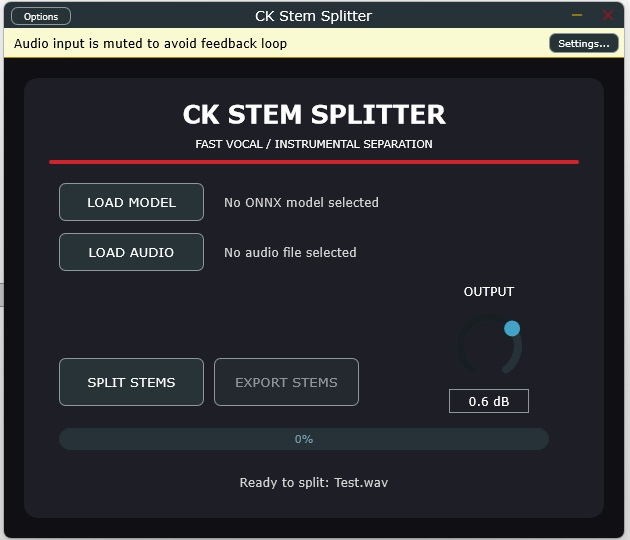

# CK Stem Splitter v0.6.1 - 4 Stem (fork)

Tools used: 

    • Cmake v4.3.1
    
    • Juce v9.1.0
    
    • Visual Studio Community 2026 v18.9.2
    
    • Inno Setup v7.1.0
    
    • Python v3.12.11
    
    • demucs-onnx 0.3.4
    
    And: Asio sdk v2.3.4, Vst-sdk v3.8.0-build66, Vst-sdk v2.4, lv2-sdk v1.18.10, aax-sdk v2.8.1, Jack2 v1.9

    

This fork is a 4-stem version (bass, drums, vocals, other) of Milkstyles' CKStemSplitter (originally a two-stem tool). Various changes have been made to both the code and the Python engine (such as activating the “Shift Tricks” parameters to reduce robotic artifacts).
The “small” version uses the “htdemucs.onnx” model (301 MB), a non-FT StemSplitio model available at the following link:  https://huggingface.co/StemSplitio/htdemucs-onnx  Installing the “small” version requires approximately 420 MB of free space.
This version still allows you to load models other than the default one, provided they are ONNX models designed for 4-stem extraction.
The “large” version uses a different engine, built using a script that enables the use of four models (although loading just one via the app interface is sufficient); these are still StemSplitio models, but in this case, they are fine-tuned and specialized individually for drums, bass, vocals, and other elements available at the link https://huggingface.co/StemSplitio/htdemucs-ft-onnx , Each model is 301 MB in size (not 316 MB as stated on the website), totaling 1.17 GB.
The two versions cannot be installed together because they would overwrite each other; furthermore, they use the same name and the same IDs.
The installer for both versions places its components in the following directories:

- the plugins in their default folders:
    • "C:\Program Files\Common Files\VST3\CK Stem Splitter.vst3"
    • "C:\Program Files\Common Files\VST2\CK Stem Splitter.dll"
    • "C:\Program Files\Common Files\LV2\CK Stem Splitter.lv2"
    • "C:\Program Files\Common Files\Avid\Audio\Plug-Ins\CK Stem Splitter.aaxplugin"
    • 
- the model in:
    • "C:\ProgramData\Commercial Kings\CK Stem Splitter\engine\models"

- the engine in:
    • "C:\ProgramData\Commercial Kings\CK Stem Splitter\engine"

the cache folder being used is:
    • “C:\Users\Eugenio\AppData\Roaming\Commercial Kings\CK Stem Splitter\Cache”

Please note that You can choose which version to install. In this regard, I would like to point out that the VST2 version requires a specific license from Steinberg; the AAX plugin, however, it won't work because is not activated by default, activating it requires a specific procedure and tools in accordance with Avid's guidelines. The standalone version supports ASIO and Jack2 (Jack for Windows).
